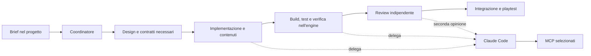

# Harness per lo sviluppo videoludico

> Aggiornamento operativo del 22 settembre 2026: la scelta degli esecutori è
> flessibile e Claude Code/OpenCode sono opzionali. Per il comportamento
> corrente leggere [agent-execution](agent-execution.md); le proposte e la
> ricerca qui sotto conservano il loro contesto iniziale.

Ricerca del 21 settembre 2026, con prima base implementata nella stessa data:
catalogo `hub.json`, sette ruoli comuni, skill `task-handoff`, schemi e modelli
di task/handoff, comandi `hub:check`, `hub:doctor` e `hub:test`. Vedi il
[contratto operativo](task-contract.md) e il [README](../README.md).

Sono presenti anche gli adattatori VS Code del coordinatore e del revisore e il link
`.agents/skills` alla directory comune; la discovery della skill è verificata
nel runtime Codex di VS Code. Vedi la [guida operativa](vscode-agents.md#primo-ruolo-e-skill-condivisa).
È implementata anche la [memoria v1](../mcp/memory/README.md), con indice
SQLite, MCP di sola lettura e comandi mise di setup. Dal 22 settembre 2026
la voce `games-memory` in `hub.json.mcp_servers` è la sorgente validata degli
adattatori generati da `hub:setup` e `hub:sync`. Il successivo
[workflow game-feature](workflows.md) aggiunge skill, stato persistente e
adattatori per grafica e programmazione. Una prima
[delega CLI a Claude Code](pipelines/claude-higgsfield.md) ha verificato la
discovery Higgsfield; il servizio richiede ancora autorizzazione.
Sono ora presenti tutti e sette gli adattatori e i launcher generali per
Claude e OpenCode; lo [stato operativo](hub-status.md) distingue i controlli
sui file dalle prove nei client.
Nella ricerca iniziale sono stati esaminati
file locali, help delle CLI e documentazione ufficiale; non sono stati avviati
task Claude, server MCP o operazioni sugli engine durante quella ricerca.
Le prove successive della memoria comprendono chiamate MCP via stdio;
le verifiche nei client e negli engine restano distinte.

La ricerca prosegue con [memoria condivisa, hook, plugin e handoff](memory-and-handoffs.md),
che definisce come conservare conoscenze e trasferire incarichi fra harness.

## Obiettivo e confini

La root `games/` ospita capacità riutilizzabili: skills, ruoli degli agenti,
flussi, integrazioni MCP, adattatori degli harness e dipendenze dei tool.
Ogni `projects/<gioco>/` ospita task, decisioni, codice, asset, verifiche e
dipendenze specifiche del gioco. I comandi di manutenzione del hub restano
nella root; backlog e avanzamento delle feature appartengono al progetto.

L'interfaccia principale richiesta dall'utente è VS Code Agents; le TUI di
Codex e Claude Code sono alternative occasionali. Il percorso normale deve
quindi essere verificato prima nella finestra Agents, usando le capacità
native del relativo harness. Il runner CLI serve per incarichi delegati che
richiedono un altro esecutore; la sessione principale rimane in VS Code.
Vedi [modalità di lavoro](../README.md#modalità-di-lavoro).

Cinque concetti distinti:

- **Interfaccia:** dove l'utente segue il lavoro, normalmente VS Code Agents
  e occasionalmente una TUI.
- **Ruolo:** responsabilità, ambito e risultato di cui un agente risponde.
- **Skill:** procedura riutilizzabile con input, passi e verifiche.
- **Harness:** ambiente di esecuzione, contesto, sessione e strumenti.
- **MCP:** interfaccia verso strumenti e risorse esterne.

Per esempio: un technical artist usa una skill di preparazione asset,
opera con Blender tramite MCP e può delegare una parte del lavoro a Claude
Code. Il nome dello strumento non determina il ruolo.

## Ruoli proposti

Questa mappatura è una scelta progettuale per un piccolo hub, informata dai
[profili dell'industria videoludica di ScreenSkills](https://www.screenskills.com/job-profiles/browse/games/).
Sette responsabilità non richiedono sette agenti sempre attivi.

| Ruolo | Consegna | Verifica |
|---|---|---|
| Coordinatore | Brief, task circoscritti, dipendenze e integrazione finale | Ogni task ha un responsabile, un risultato e prove di completamento |
| Game designer | Regole, loop, interazioni, parametri e scenari di playtest | Il comportamento corrisponde al brief; il playtest umano valuta esperienza e divertimento |
| Architetto software | Confini dei sistemi, dati, contratti e budget pertinenti | Coerenza e fattibilità, con prove dei punti incerti |
| Programmatore gameplay e integrazione | Funzionalità giocabile nell'engine scelto | Build, esecuzione e casi funzionali |
| Technical artist e contenuti | Asset integrati, materiali, importazione e provenienza | Controllo visivo nell'engine e rispetto dei budget |
| QA, performance e build | Riproduzioni dei difetti, test, build identificata e misure | Risultati sulla build e piattaforma di destinazione |
| Revisore indipendente | Rilievi motivati, esito e verifiche mancanti | Evidenze riferite all'esatta versione esaminata |

Il coordinamento riprende le responsabilità organizzative del
[producer](https://www.screenskills.com/job-profiles/browse/games/production/games-producer-games/).
Il collegamento fra arte e programmazione appartiene al
[technical artist](https://www.screenskills.com/job-profiles/browse/games/technical-art/technical-artist/).
La direzione creativa rimane all'utente; un giudizio del modello non dimostra
che il gioco sia divertente.

Per QA, distinguere test funzionali, regressioni visive e stress test, come
nell'[Automation Test Framework di Epic](https://dev.epicgames.com/documentation/unreal-engine/automation-test-framework-in-unreal-engine).
Le misure di prestazioni devono rappresentare il target: Unity documenta il
[profiling sul dispositivo di destinazione](https://docs.unity.com/en-us/engine/6000.6/manual/analysis/profiler/profiling-applications/profiling-target-device).

### Riutilizzo delle definizioni attuali

- `arch-ecs` e `arch-netcode`: specializzazioni dell'architetto, da attivare
  quando richieste dal progetto.
- `env-unity`, `env-unreal`, `env-bukkit`: specializzazioni del programmatore
  e procedure di integrazione nell'ambiente.
- `asset-blender`, `asset-meshy`, `asset-higgsfield`: procedure e strumenti
  utilizzabili dal technical artist.
- `codex`: ponte verso un esecutore, distinto dal ruolo di revisore.

Le definizioni esistenti in `.claude/agents/` restano intatte in questa fase.

## Struttura proposta

```text
games/
  hub.json                 # catalogo condiviso, inclusa la sezione mcp_servers
  agents/                  # definizioni comuni dei ruoli
  skills/<nome>/SKILL.md    # procedure condivise e relative risorse
  workflows/               # passaggi riutilizzabili tra i ruoli
  mcp/                     # componenti locali dei server MCP
    memory/                # componente MCP per la memoria condivisa
  memory/                  # note comuni del hub
  .games/cache/            # indici locali ricostruibili, esclusi da Git
  scripts/                 # launcher, delega e adattamento configurazioni
  templates/project/       # istruzioni e struttura iniziale di un gioco
  docs/                    # documentazione del hub
  mise.toml                # dipendenze e manutenzione del hub
  .claude/                 # integrazione nativa Claude
  .codex/                  # integrazione nativa Codex
  .agents/                 # collegamenti per la discovery delle skills
  .vscode/                 # integrazione editor e Agents
  projects/<gioco>/
    tasks/                 # lavoro, avanzamento e prove del progetto
    docs/                  # design e decisioni specifici
    memory/                # note del gioco, con riferimenti alle fonti
    .games/cache/          # indice locale del checkout, escluso da Git
    ...                    # sorgenti, asset, build e dipendenze dell'engine
```

La struttura completa è un obiettivo; lo stato effettivo è nel README.
La struttura interna dei giochi rispetterà
le convenzioni del rispettivo engine. Gli asset prodotti per un gioco
appartengono al gioco; nel hub possono restare template e risorse riutilizzabili.

### Disponibilità tra harness

Una sorgente condivisa richiede registrazione esplicita nei diversi runtime.
Lo standard [Agent Skills](https://agentskills.io/specification) definisce
`SKILL.md`, metadati e risorse; non uniforma discovery, permessi o strumenti.
Nel corpo comune terremo procedure indipendenti dal runtime. Impostazioni
di modello, tool e delega specifica appartengono agli adattatori.

| Componente | Codex CLI | Claude Code CLI | Integrazione VS Code |
|---|---|---|---|
| Skills | `.agents/skills/` | `.claude/skills/` | `.agents/skills/`, `.claude/skills/`, `.github/skills/` |
| Agenti | `.codex/agents/*.toml` | `.claude/agents/*.md` | `.github/agents/*.agent.md`; supporto anche al formato Claude |
| MCP | `.codex/config.toml`, `mcp_servers` | `.mcp.json`, `mcpServers` | `.vscode/mcp.json`, `servers` |

La colonna VS Code descrive l'integrazione dell'editor, non un terzo harness:
il caricamento e l'applicazione delle configurazioni dipendono dal target
scelto. La matrice va verificata sul percorso concreto usato dal progetto.

Riferimenti: [skills Codex](https://learn.chatgpt.com/docs/build-skills),
[subagenti Codex](https://learn.chatgpt.com/docs/agent-configuration/subagents),
[MCP Codex](https://learn.chatgpt.com/docs/extend/mcp?surface=cli),
[skills Claude](https://code.claude.com/docs/en/skills),
[subagenti Claude](https://code.claude.com/docs/en/sub-agents),
[skills VS Code](https://code.visualstudio.com/docs/agent-customization/agent-skills),
[agenti VS Code](https://code.visualstudio.com/docs/agent-customization/custom-agents),
[MCP VS Code](https://code.visualstudio.com/docs/agents/reference/mcp-configuration).

I giochi possono essere repository Git autonomi: non possiamo presumere che
il runtime risalga fino alle skills del hub. Codex documenta la ricerca fino
alla root del repository e supporta symlink. Claude permette di aggiungere
skills tramite `--add-dir`. La
[ricerca nelle directory superiori di VS Code](https://code.visualstudio.com/docs/agent-customization/overview)
ha proprie impostazioni e limiti.

Il bootstrap di progetto dovrà quindi collegare o materializzare le risorse
nelle posizioni riconosciute, oppure usare i meccanismi di caricamento
esplicito. Verificare discovery e assenza di duplicati per ogni harness.
Le copie generate dovranno essere riconoscibili e aggiornabili dalla sorgente
comune, senza sovrascrivere personalizzazioni del progetto.

Codex CLI e Codex dentro VS Code vanno provati separatamente: la
[guida Microsoft](https://code.visualstudio.com/docs/agents/guides/customize-copilot-guide)
documenta differenze, inclusa la mancata applicazione del campo `tools` degli
agenti come allowlist nel proprio harness Codex. Il prompt di un ruolo non
costituisce una restrizione dei permessi.

## Claude Code come strumento condiviso

Proposta: un runner del hub, invocabile dagli agenti con accesso alla shell,
che avvia Claude Code nella directory del progetto. Tre operazioni:

| Operazione | Incarico | Risultato atteso |
|---|---|---|
| `implement` | Realizzare una modifica delimitata | File modificati, controlli eseguiti, esiti e limiti |
| `review` | Esaminare una versione o diff preciso in una sessione separata | Verdetto motivato, rilievi, evidenze e verifiche mancanti |
| `mcp-task` | Completare un'operazione con gli MCP necessari | Artefatti, stato osservato dello strumento e verifica dell'esito |

Questi nomi descrivono l'interfaccia da costruire; non sono comandi già
implementati. Per harness privi di shell si potrà esporre la stessa
interfaccia tramite un adattatore MCP, se necessario.

L'utente richiederà normalmente queste operazioni dalla sessione VS Code
Agents. Il processo Claude delegato deve restituire ID del job, stato,
avanzamento, risultato e riferimenti a log e artefatti al chiamante. Una
chiamata a `claude -p` non va
presentata come una nuova sessione nativa della lista VS Code: un'integrazione
di quel tipo richiederebbe supporto e verifica separati.

La base documentata è `claude -p`: esegue una sessione non interattiva e può
restituire JSON o un risultato conforme a uno schema. Il runner controllerà
uscita del processo, esito, rifiuti dei permessi e disponibilità degli MCP.
Il funzionamento dei tre percorsi resta da provare localmente.
[Esecuzione programmatica](https://code.claude.com/docs/en/headless).

La delega userà la configurazione di autenticazione CLI già predisposta.
`--bare` ignora il login in abbonamento e il Portachiavi: non è adatto a
questo percorso. La configurazione OAuth dell'harness Claude nella finestra
VS Code rimane sospesa; non è stata ripresa per questa ricerca.
[Comportamento di bare mode](https://code.claude.com/docs/en/headless#start-faster-with-bare-mode).

Il job deve specificare: progetto, ruolo, obiettivo, input/versione, ambito
modificabile, profilo strumenti, risultato atteso e controlli richiesti.
Prevedere un limite di turni e un timeout del processo; `--max-turns` non
limita da solo il tempo. Per la review partire da una sessione nuova, senza
riprendere la conversazione di implementazione.
[Riferimento CLI](https://code.claude.com/docs/en/cli-reference).

I profili devono applicare i permessi effettivi: lettura per review, scrittura
delimitata per implementazione, tool MCP selezionati per operazioni esterne.
`--allowedTools` preapprova operazioni e non equivale a un filtro globale;
hooks e configurazioni caricate possono avere effetti propri. Nessun bypass
dei permessi è richiesto dal progetto del runner.
[Permessi Claude Code](https://code.claude.com/docs/en/permissions).

### MCP diretti e delegati

Ogni harness potrà collegarsi direttamente agli MCP necessari oppure
delegare a Claude Code un'operazione che li utilizza. Per la sessione delegata,
`--mcp-config` e `--strict-mcp-config` permettono una configurazione esplicita.
[Configurazione CLI](https://code.claude.com/docs/en/cli-reference).

`claude mcp serve` espone strumenti di Claude Code a un client esterno.
La documentazione non lo presenta come endpoint per ottenere una review
ragionata né garantisce che riesponga tutti gli MCP collegati. Non è quindi
il contratto scelto per il runner.
[Claude Code come server MCP](https://code.claude.com/docs/en/mcp#use-claude-code-as-an-mcp-server).

Il catalogo `hub.json.mcp_servers` descrive ora `games-memory`: trasporto
stdio, runtime Node, entrypoint JavaScript locale dentro `mcp/`, argomenti e
ambiente non segreto. Lo schema v1 ammette argomenti letterali portabili e
oggetti `{ "root": "hub" }`; `project_args`, opzionale e aggiunto soltanto
per un progetto selezionato, ammette anche `{ "root": "project" }`.
`hub:setup` e `hub:sync` validano questi dati e generano le configurazioni
native; una definizione assente o invalida non viene sostituita da valori
predefiniti nel codice. Vedi il [formato del catalogo memoria](../mcp/memory/README.md#catalogo-e-adattatori).

La generazione distribuisce soltanto `games-memory`. Meshy, Higgsfield,
Unity, Unreal e Blender restano nelle configurazioni esistenti e sono
preservati: la loro migrazione richiederà definizioni e verifiche proprie.
Profili di utilizzo, ulteriori runtime, trasporti e controlli di disponibilità
restano da progettare. I client usano configurazioni proprie; condividere il
catalogo non implica condividere la stessa connessione.
I server stdio normalmente servono un client; quelli HTTP possono servirne
più di uno. [Architettura MCP](https://modelcontextprotocol.io/docs/learn/architecture).

Per scene e documenti aperti in un engine o Blender, assegnare un solo agente
scrivente alla volta alla stessa risorsa. Anche due connessioni funzionanti
possono intervenire sulla medesima scena. Le credenziali rimangono fuori dal
catalogo, referenziate tramite ambiente.

## Workflow minimo



Il chiamante mantiene la responsabilità dell'integrazione. La delega ha un
perimetro esplicito; ulteriori deleghe si consentono solo se previste dal job,
evitando catene circolari tra harness. Le modifiche successive alla review
richiedono una verifica pertinente della nuova versione.

## Mise come interfaccia operativa

Per la v1.0, `mise` gestirà toolchain, ambiente e comandi ripetibili richiamati
da VS Code Agents, hook e TUI. I [task mise](https://mise.jdx.dev/tasks/)
eseguono comandi con strumenti e ambiente del progetto; le
[dipendenze fra task](https://mise.jdx.dev/tasks/task-configuration.html#depends)
permettono di dichiarare l'ordine delle operazioni e parallelizzare controlli
indipendenti.

### Già presente

- Node `22.23.2` e uv `0.12.17` dichiarati nel `mise.toml` del hub.
- `agents`, `agents-editor`, `agents-check`: avvio e stato dell'istanza dedicata.
- `codex`, `claude`: avvio delle CLI già installate; non ne gestiscono ancora
  installazione e versione.
- `mcp`: elenco dei server visti da Claude, non verifica comune a tutti gli
  harness. I task OAuth restano sospesi.
- `hub:check`: catalogo, definizioni MCP ed entrypoint locali, documenti dei
  ruoli, frontmatter della skill, schemi e modelli; eventuali task di gioco
  soltanto se indicati esplicitamente.
- `hub:doctor`: versioni, presenza di VS Code e nomi MCP configurati, senza
  provare autenticazioni, inferenza o connessioni.
- `hub:test`: test del validatore e delle condizioni dei contratti.
- `hub:setup`: dipendenze bloccate e frammenti MCP locali derivati da
  `hub.json.mcp_servers`; `hub:sync` usa lo stesso catalogo validato e,
  con client esplicito e `--apply`, registra il solo adattatore memoria.
- `memory:index`, `memory:status`, `memory:search`, `memory:read`: indice e
  accesso alle note ammesse dai manifest del hub e dei checkout selezionati.
- `workflow`: stato, dipendenze, hash e handoff di una run esplicita nel
  progetto. La delega viene eseguita dal coordinatore tramite il runtime;
  il comando non avvia agenti né servizi.
- `claude:run`, `opencode:run`: esecutori opzionali con checkout e brief
  espliciti, senza installazione o login automatico; vedere
  [esecutori e limiti](executors.md).

### Comandi proposti, ancora da implementare

| Ambito | Task indicativo | Responsabilità |
|---|---|---|
| Hub | Estensione di `hub:sync` | Collegare anche gli adattatori di ruolo e gli MCP oltre alla memoria |
| Gioco | `build`, `test`, `verify`, `assets:export` | Eseguire le procedure specifiche dell'engine e della piattaforma |

Ogni gioco definirà il proprio `mise.toml`. Per indirizzarlo esplicitamente
dalla root si potrà usare, una volta definito il task:

```sh
mise -C projects/<gioco> run verify
```

La [gerarchia di configurazione](https://mise.jdx.dev/configuration.html#configuration-hierarchy)
può ereditare strumenti e ambiente dai genitori. Per mantenere il gioco
autonomo, le sue dipendenze necessarie e i suoi task devono essere dichiarati
nel progetto; la compatibilità va verificata anche fuori dalla root `games`.
I launcher attuali `agents` e `codex` sono orientati al hub, non selettori
generici di gioco.

Gli MCP stdio potranno essere avviati tramite `mise exec` con directory
esplicita e strumenti coerenti. I rispettivi client conservano configurazione
e ciclo di vita delle connessioni. Evitare output di task o altri messaggi
su stdout che interferiscano con il protocollo MCP.

Un hook del runtime potrà richiamare un task, ad esempio per validare un
handoff. L'evento che lo attiva appartiene all'harness; il comando eseguito
è condiviso. Memoria, interpretazione dell'incarico e stato delle sessioni
restano responsabilità dei componenti descritti nella proposta.

### MCP nativo di mise e compatibilità

La CLI locale verificata è `mise 2026.4.19`; espone già `mise mcp`, marcato
sperimentale. Il [server MCP di mise](https://mise.jdx.dev/mcp.html) permette
di consultare task e strumenti ed eseguire task. La CLI locale elenca anche
risorse per ambiente e configurazione: prima di adottarlo bisogna delimitare
task e dati accessibili. Non è stato attivato; il percorso iniziale resta
`mise run`/`mise exec` attraverso gli strumenti autorizzati dell'harness.

La documentazione corrente include funzioni più recenti della versione
installata. La v1 verificherà ogni funzione usata sulla versione supportata,
senza dipendere da aggiornamenti impliciti di mise. La memoria v1 usa
esplicitamente `node:sqlite`, ancora sperimentale in Node 22: la versione
è fissata e l'accesso è isolato nel modulo memoria e coperto da test.

Le variabili riservate restano nell'ambiente. La configurazione esistente
può caricare un `.env`, ma gli agenti non vi scrivono credenziali. La
[redazione dell'output](https://mise.jdx.dev/environments/#redactions) maschera
i valori nei flussi intercettati; `raw = true`, necessario alle TUI, passa
direttamente l'output e non applica quella mascheratura. I task non devono
stampare credenziali.

## Stato locale e prossimi passi

Verificato sui file: il catalogo comune affianca i ruoli Claude esistenti;
i sette adattatori VS Code sono presenti e associati ai ruoli canonici nel
catalogo. Coordinatore e revisore hanno una prova nell'Agent Host; la
discovery e l'uso degli altri cinque restano da osservare. `.mcp.json`
elenca Meshy, Higgsfield, Unity e Unreal, mentre `.vscode/mcp.json` include
anche Blender e ora `games-memory`. La memoria è registrata soltanto in
VS Code per evitare duplicazioni; i frammenti TUI sono locali. La restante
divergenza di configurazione non è la prova di un
guasto. La disponibilità va verificata per ogni client: nella discovery CLI
Claude Higgsfield ha risposto `needs-auth`; il MCP Blender non era connesso.

Ordine proposto per l'implementazione:

1. **Completato:** definire ruoli comuni, skill di handoff e contratti
   validabili, con comandi `mise` per controllare la base.
2. **Completata la prova minima:** discovery della skill verificata nel
   runtime Codex; selettori e prova funzionale confermati dalla trascrizione
   dell'utente in VS Code Agents. Il coordinatore legge le fonti comuni e
   applica correttamente il contratto a un esempio. È completata anche una
   [review del hub fra subagenti Codex](verification/coordinator-reviewer/result.md)
   con contesti separati e snapshot verificato. Anche la
   [delega nel runtime VS Code Games](verification/coordinator-reviewer/native-result.md)
   è verificata tramite i log dell'Agent Host e delle sessioni, con rapporto
   restituito e 13 input invariati. Resta da verificare un task di gioco.
3. **Memoria v1 implementata:** note versionate, indice SQLite e tre strumenti
   MCP in sola lettura, con setup e adattatori generati dalla voce
   `games-memory` del catalogo. Validazione e trasporto stdio hanno prove
   proprie; completare separatamente le prove nei client e sulle piattaforme
   di destinazione. Gli altri MCP rimangono da migrare e verificare nel
   percorso principale; nessuna di queste verifiche sostituisce un controllo
   del gioco nell'engine.
4. **Esecutori CLI opzionali:** Claude Code ha risposto alla prima discovery
   con il login locale claude.ai/Max. I launcher generali Claude e OpenCode
   sono disponibili con test locali; l'esecuzione di un incarico reale
   attraverso ciascun launcher resta da verificare. Per il ramo generativo
   servono l'autenticazione Higgsfield e una generazione; per mock e UV è
   disponibile anche il percorso locale senza servizi generativi.
5. Verificare gli accessi alternativi dalle TUI Codex e Claude sullo stesso
   progetto, usando lo stato persistente senza dipendere dalla chat VS Code.
6. **Pilot predisposto:** `projects/prova-3d-pipeline-one`, con progetto Unity
   inizializzato e workflow documentale. Completare produzione degli asset,
   gameplay, import, verifica nell'engine e review: vedere la
   [milestone workflow](verification/workflow-v1/README.md).

`gc` resta escluso. Il pilot è stato scelto successivamente alla ricerca
iniziale; le definizioni Claude preesistenti non sono state migrate.
Lo [stato operativo](hub-status.md) raccoglie le verifiche aperte; questa
ricerca conserva anche il contesto delle decisioni precedenti.
