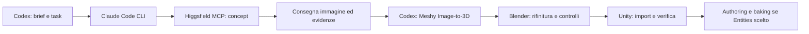

# Dal concept all'asset in Unity

Procedura riutilizzabile proposta il 22 settembre 2026. Descrive il percorso
da implementare e verificare: non certifica una generazione, una sessione
Blender o un'importazione Unity già riuscita.
Il primo progetto di riferimento è
[`prova-3d-pipeline-one`](../../projects/prova-3d-pipeline-one/).
L'asset iniziale assunto per una prova semplice è una **cassa sci-fi statica**;
un corpo deformabile segue anche il ramo dedicato sotto.

Il coordinatore è Codex. Questo documento descrive il **percorso opzionale
con generazione remota**: Claude Code può usare Higgsfield MCP e restituire
il concept, poi seguono Meshy, Blender e Unity. La scelta dell'esecutore è
flessibile: leggere [agent-execution](../agent-execution.md). Se il brief
richiede mock, riuso o asset locali, usare [local-art](../../skills/local-art/SKILL.md)
senza dipendere da Claude Code, Higgsfield o Meshy. Una specifica richiesta
di generazione remota non si considera soddisfatta con un mock non concordato.
Il login CLI Claude e l'autorizzazione Higgsfield rimangono distinti da OAuth
Claude in VS Code, sospeso su richiesta dell'utente.

## Incarico e artefatti

Il task e gli handoff seguono il [contratto comune](../task-contract.md).
Il progetto conserva brief, stato ed evidenze in `tasks/<task_id>/`; il hub
conserva questa procedura. Ogni incarico passa la root effettiva del checkout,
gli input identificati, l'ambito di scrittura e i criteri di accettazione.
La conversazione nativa non è il mezzo di trasferimento fra harness.

Prima di generare, il task specifica profilo statico o deformabile, stile,
scala attesa, viste necessarie, budget di geometria e texture, destinazione
Unity e limiti di spesa applicabili. I valori mancanti restano espliciti;
non attribuire all'asset budget o compatibilità non verificati.
Ogni tentativo rispetta le autorizzazioni e il budget del task.

Separare gli artefatti per funzione. I seguenti sono percorsi proposti,
relativi al checkout del progetto; `<unity-root>` si risolve quando viene
scelto il progetto Unity effettivo:

| Artefatto | Destinazione proposta | Uso |
|---|---|---|
| Concept approvato rispetto al brief | `assets/concepts/<asset_id>/concept.png` | Riferimento del modello, conservato insieme al prompt |
| Risultato Meshy originale | `assets/generated/<asset_id>/<run_id>/original.glb` | Sorgente immutata per confronto e ripartenza |
| Sorgente di lavorazione Blender | `assets/source/<asset_id>/<asset_id>.blend` | Geometria, materiali, rig e lavorazioni modificabili |
| Export consegnato | `assets/exports/<asset_id>/` | FBX e texture esplicite, con manifest e hash |
| Copia importata e prefab | `<unity-root>/Assets/Art/<asset_id>/` | Asset destinati al progetto Unity |
| Rapporti e immagini di verifica | `tasks/<task_id>/evidence/` | Risultati riferiti alla versione controllata |

Il `.blend` resta **fuori da Unity `Assets/`**. L'importazione usa gli export
espliciti, così il risultato consegnato è identificabile separatamente dal
file di lavoro. Una modifica al sorgente richiede nuovo export e nuove
verifiche pertinenti; non sostituire l'originale Meshy con una versione rifinita.

## 1. Concept tramite Claude Code e Higgsfield

Codex consegna a Claude Code un incarico limitato: produrre il concept con
Higgsfield MCP, salvare l'immagine nel progetto e restituire le evidenze.
Claude Code non deve dichiarare una generazione riuscita se ha soltanto
descritto il prompt o individuato il server.

Il MCP ufficiale Higgsfield usa l'endpoint `https://mcp.higgsfield.ai/mcp`
e l'autorizzazione OAuth dell'account Higgsfield, senza API key. Le generazioni
MCP usano crediti dell'account; le condizioni Unlimited/free dell'interfaccia
web non si applicano automaticamente al percorso automatizzato.
[Documentazione Higgsfield MCP](https://higgsfield.ai/creator-hub/help-center/integrations/what-is-higgsfield-mcp).

Per la cassa statica, il brief propone un singolo oggetto leggibile, vista
che mostri le forme principali, sfondo semplice e assenza di parti nascoste
da effetti grafici. Per un corpo deformabile deve rendere leggibili le
articolazioni richieste e la posa di riferimento. Sono criteri del brief,
non garanzie del generatore.

Claude restituisce il PNG effettivamente salvato, prompt, modello e parametri
usati, identificativi reali disponibili, hash e risultato del controllo
dell'immagine. Se l'output originale ha un altro formato, registrare anche
origine e conversione: rinominare un file non lo converte in PNG.
Codex verifica che il file esista e corrisponda alla consegna prima di
passarlo a Meshy. Non sostituire il passaggio MCP con l'API REST senza
modificare esplicitamente l'incarico.

## 2. Modello iniziale con Meshy

Codex fornisce l'immagine a Image-to-3D come URL accessibile al servizio o
Data URI. Il task ID Higgsfield non è un `input_task_id` Meshy: quel campo
si riferisce a task immagine del servizio Meshy.
`texture_prompt` guida la **texturizzazione**, non costituisce un comando
generale per correggere la geometria derivata dall'immagine.
[Image-to-3D API](https://docs.meshy.ai/en/api/image-to-3d).

Registrare versione/modello Meshy, parametri effettivi di geometria, remesh,
texture e formati richiesti. Prima della chiamata controllare lo schema
degli strumenti MCP presenti: la disponibilità di un parametro REST non
dimostra che la versione MCP installata lo esponga.
Il MCP ufficiale richiede `MESHY_API_KEY` nell'ambiente e documenta generazione,
stato del task e download del modello.
[Meshy AI Integration](https://docs.meshy.ai/en/api/ai).

Il percorso Image-to-3D documenta GLB, OBJ, FBX, STL, USDZ e 3MF;
non assumere un `.blend` come output diretto di questo passaggio.
La procedura conserva il GLB originale e crea il sorgente `.blend` durante
la lavorazione in Blender.
[Formati Image-to-3D](https://docs.meshy.ai/en/api/image-to-3d).

Non attivare **Auto Split** come passaggio predefinito. L'API documentata
divide il modello per la stampa, può esportare anche `.blend`, ma ricostruisce
le parti e perde le texture originali. Non risolve automaticamente la
deformazione di ginocchia, gomiti o collo.
[Auto Split API](https://docs.meshy.ai/en/api/auto-split).

## 3. Rifinitura in Blender

Importare il GLB e salvare una copia di lavoro nel percorso sorgente.
Controllare orientamento, scala, origine, topologia, normali, UV e materiali;
registrare i difetti rilevati e le correzioni effettive. Confrontare con il
concept e con il budget del task. Per la cassa statica, verificare soprattutto
silhouette, superfici, spigoli, dimensioni e materiali alle distanze previste.

Per un **corpo deformabile**, l'obiettivo chiamato informalmente “split” è
preparare deformazioni corrette. Non separare automaticamente un corpo
organico continuo in pezzi. Il ramo prevede:

1. Esaminare la topologia nelle zone da piegare e fare retopologia dove
   necessario, con edge loop utili intorno a ginocchia, gomiti e collo.
2. Preparare o correggere armatura e rig: posizione e orientamento delle
   articolazioni, gerarchia e posa di riferimento coerenti con il personaggio.
3. Eseguire skinning e weight paint, eliminando influenze indesiderate e
   controllando il comportamento vicino alle articolazioni.
4. Aggiungere corrective shape keys soltanto se necessarie e compatibili
   con il percorso di export e animazione scelto.
5. Provare pose alle ampiezze ragionevoli definite nel task, salvando
   screenshot e osservazioni su schiacciamenti, perdita di volume,
   compenetrazioni e continuità della superficie.

La separazione reale in oggetti può avere senso per parti rigide di
armature o robot, quando il design lo richiede. Va motivata e verificata
nel task, senza usarla come sostituto del lavoro su topologia e pesi.

## 4. Export e verifica in Unity

Esportare FBX e texture dalla versione Blender controllata. Per asset
deformabili includere armatura e animazioni richieste; identificare le clip
e verificare esplicitamente l'eventuale trasferimento delle correzioni.
Il manifest di export elenca file, hash, scala/orientamento adottati e
impostazioni effettive, senza affidarsi soltanto al nome del file.

In Unity controllare l'importazione, materiali e texture, dimensioni,
orientamento e rendering; creare il prefab necessario al progetto.
Per un corpo deformabile ripetere le pose o riprodurre le clip e confrontare
il risultato con le evidenze Blender. Il solo import senza errori non
dimostra che la deformazione sia corretta.

**Authoring e baking si aggiungono solo se il progetto sceglie Unity Entities.**
Registrare versioni dei pacchetti, percorso di rendering e soluzione di
animazione. Non presumere che Entities Graphics renda automaticamente
compatibili skinned mesh, rig o Animator. Per un personaggio, il task deve
scegliere e verificare esplicitamente la soluzione di animazione, inclusa
un'eventuale combinazione di GameObject e sistemi ECS.
Il ramo statico e quello deformabile richiedono evidenze distinte.

## Consegna e chiusura

Ogni passaggio restituisce un rapporto al coordinatore. Usare i file task
e handoff del contratto comune; i dettagli di esecuzione e asset possono
stare in allegati referenziati, senza introdurre campi non previsti negli schemi.
Il rapporto include:

- task ID e identificativi reali di sessione, richiesta o generazione,
  distinguendo Claude, Higgsfield e Meshy; se un servizio non restituisce un
  ID, indicarlo come non disponibile anziché inventarlo;
- prompt e impostazioni effettivamente inviati, versioni note e hash degli
  input; annotare variazioni e tentativi successivi;
- stato osservato, errori e tentativi falliti, costi o crediti consumati se
  disponibili; l'assenza di un dato di costo non equivale a costo zero;
- per ogni artefatto, percorso relativo al checkout, funzione, formato e
  hash SHA-256; il coordinatore verifica gli hash dei file ricevuti;
- controlli eseguiti, esiti, screenshot pertinenti, limiti e passo successivo.

Non salvare segreti nei prompt, nei rapporti o nei file di configurazione.
Conservare l'artefatto locale e gli identificativi necessari alla tracciabilità,
senza trattare link di download temporanei come archivio permanente.
Le API documentano URL di output a scadenza:
[Meshy quickstart](https://docs.meshy.ai/en/api/quick-start) e
[ciclo delle richieste Higgsfield](https://docs.higgsfield.ai/docs/concepts/requests).

Codex integra le consegne e chiude il task soltanto quando i criteri scelti
sono verificati. Un PNG ottenuto non certifica il 3D; un modello rifinito
non certifica l'importazione; una scena visibile non certifica il baking
o il comportamento in esecuzione. All'adozione iniziale di questa procedura,
nessuna generazione o prova della catena completa è dichiarata eseguita.
