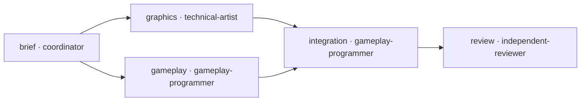

# Workflow persistenti

Il workflow `game-feature` registra una feature attraverso brief, due rami
paralleli, integrazione e review. Il coordinatore usa gli strumenti di delega
del runtime effettivamente disponibile. La CLI conserva lo stato e prepara
le consegne: **non crea agenti, non chiama modelli, non avvia MCP o Unity**.
Non è un daemon e non prosegue autonomamente quando la sessione termina.

La definizione comune è [`workflows/game-feature.json`](../workflows/game-feature.json),
validata dallo [schema v1](../schemas/workflow.schema.json). Lo stato di ogni
esecuzione vive nel progetto in `tasks/<task_id>/workflow.json`, insieme alle
copie degli input e ai rapporti. È un allegato operativo al
[contratto task/handoff](task-contract.md): non ne modifica gli schemi e non
chiude automaticamente il `task.json` del progetto.



## Responsabilità e ambiti

| Fase | Adattatore dichiarato | Ambito di scrittura |
|---|---|---|
| `brief` | `games-coordinator` | `tasks/<id>/brief/` |
| `graphics` | `games-graphics` | `assets/`, `tasks/<id>/graphics/` |
| `gameplay` | `games-programmer` | `unity/Assets/Scripts/`, `tasks/<id>/gameplay/` |
| `integration` | `games-programmer` | `unity/Assets/`, `tasks/<id>/integration/` |
| `review` | `games-reviewer` | Nessuna scrittura |

Grafica e gameplay possono essere `running` contemporaneamente. La grafica
consegna gli asset fuori dal progetto Unity; soltanto l'integrazione importa
asset, scene e prefab dopo il completamento di entrambi i rami. Un controllo
aggiuntivo rifiuta l'avvio di fasi con scope sovrapposti a una fase running
della stessa run. Fra task differenti il coordinatore deve assegnare aree
distinte o serializzare il lavoro: non esiste un lock globale sugli asset.
Questi ambiti delimitano gli incarichi, ma non configurano una sandbox dei
processi delegati: il coordinatore deve applicare i permessi del runtime.

Il nome dell'adattatore indica quale definizione usare; non dimostra che un
client l'abbia scoperta o che la delega sia avvenuta. Per ogni fase il
coordinatore registra l'identificativo dell'esecutore effettivo. Il revisore
restituisce il rapporto senza scrivere; il coordinatore lo salva nella
directory della fase review e registra la consegna.

Quando il catalogo dichiara `adapters`, `hub:check` e l'inizializzazione di
una run rifiutano destinatari non catalogati o associati a un ruolo diverso
da quello della fase. `adapter: null` rimane valido per una fase senza
adattatore nativo. I cataloghi v1 precedenti senza quella sezione conservano
il comportamento originario; le run già salvate mantengono la loro
definizione congelata e non vengono migrate da questo controllo.

## Avvio e ripresa

I comandi si eseguono dalla root del hub con la toolchain mise. La root del
progetto deve essere assoluta ed esistere; il brief deve essere un file
esistente relativo a quel checkout. Il controller non cerca progetti e non
scansiona `projects/`.

```sh
mise exec -- node scripts/workflow.mjs init \
  --project-root /percorso/al/progetto \
  --task-id feature-one \
  --brief docs/brief.md

mise exec -- node scripts/workflow.mjs status \
  --project-root /percorso/al/progetto \
  --task-id feature-one
```

`init` salva il workflow, il brief originale e i relativi SHA-256 sotto
`tasks/feature-one/workflow-inputs/`. La definizione predefinita è
`workflows/game-feature.json`; `--workflow` può scegliere un altro JSON
locale dentro `workflows/`, validato per schema, ruoli e dipendenze.
Una run esistente non viene sovrascritta: per riprenderla si usa `status`,
per un incarico diverso si sceglie un altro task ID.

La validazione rifiuta cicli, dipendenze mancanti, ID duplicati e scope con
attraversamenti. Gli input vengono risolti nel checkout esplicito; symlink
esterni e file riservati come `.env`, `.git` e `.games` non sono ammessi come
input o evidenze. Le scritture dello stato non attraversano symlink.

## Dialogo, checkpoint e pausa

Il coordinatore può confrontarsi con l'utente in qualsiasi fase e procede
autonomamente entro l'incarico e i checkpoint concordati. Il comportamento
predefinito non richiede un'approvazione per ogni comando: senza
`--review-after`, la conclusione delle dipendenze abilita le fasi successive.
Anche le run precedenti, prive di `controls`, mantengono questo comportamento;
leggerne lo stato non modifica i file esistenti.

Per richiedere una decisione umana dopo fasi specifiche, dichiararle all'avvio:

```sh
mise exec -- node scripts/workflow.mjs init \
  --project-root /percorso/al/progetto --task-id feature-one \
  --brief docs/brief.md --review-after brief --review-after review
```

`--review-after` è ripetibile, accetta soltanto fasi della definizione e non
si può aggiungere retroattivamente a una run. In questo esempio, dopo il
brief i rami aspettano la decisione umana; dopo la review la run aspetta
l'accettazione finale. Gli altri rami indipendenti possono proseguire.
`status` espone `awaiting_approval`, i controlli e gli eventuali
`approval_blockers` per fase; `ready` tiene conto anche di checkpoint e pausa.
`awaiting-approval` indica un'attesa quando non ci sono worker running,
oppure quando tutte le fasi sono complete ma manca l'accettazione finale.

Il coordinatore registra un'approvazione **effettivamente espressa
dall'utente**, dopo avergli presentato la consegna. Conserva la decisione
in un file JSON nel progetto, preferibilmente
`tasks/<id>/decisions/<step>.json`. Questo esempio è illustrativo, non è
un'approvazione già ricevuta:

```json
{
  "task_id": "feature-one",
  "step_id": "brief",
  "decision": "accept",
  "user_statement": "Sì, approvo.",
  "source": "riferimento al messaggio effettivo dell’utente"
}
```

`task_id` e `step_id` devono corrispondere alla fase; `decision` deve essere
`accept`; `user_statement` e `source` sono stringhe non vuote. Il testo e la
fonte devono rappresentare la decisione reale, senza credenziali o contenuti
sensibili. Il comando registra soltanto percorso e hash del file, lo
snapshot dei rapporti/evidenze accettati e l'ora della registrazione:

```sh
mise exec -- node scripts/workflow.mjs accept \
  --project-root /percorso/al/progetto --task-id feature-one --step brief \
  --decision tasks/feature-one/decisions/brief.json
```

L'approvazione è ammessa soltanto dopo `finish`, con rapporti ed evidenze
ancora integri. La decisione deve essere distinta dagli input e dalle
consegne; non può essere un symlink né un file riservato. Il controller
valida struttura e hash: **non autentica la persona e non dimostra che il
consenso sia stato espresso**. Il coordinatore ne resta responsabile.
È possibile registrare anche un'accettazione aggiuntiva di una fase
completata senza introdurre nuovi checkpoint obbligatori per le altre fasi.

Prima di ogni `start`, il controller controlla i checkpoint degli antenati,
inclusi quelli già utilizzati: una decisione o un rapporto approvato cambiato,
mancante o sostituito tramite symlink invalida l'accettazione e blocca nuovi
discendenti. Anche sostituire lo snapshot registrato invalida la decisione.
Le approvazioni non vengono
sovrascritte; ripristinare i file originali oppure aprire un task correttivo
collegato. I byte degli input diretti sono verificati secondo le regole di
`inputs` e `resume_inputs`. `controls.approvals[].delivery_changes` segnala
anche differenze rispetto alle consegne storiche approvate. Una modifica a
un'evidenza è ammessa soltanto quando una fase discendente è stata avviata,
ha ricevuto quel percorso con l'hash tracciato tramite le proprie dipendenze
e dispone dello scope per modificarlo. Durante il lavoro running sono ammessi
gli aggiornamenti nel suo scope; dopo un blocco o un retry i byte devono
corrispondere al checkpoint. Dopo `finish` servono la nuova evidenza con hash
e il rapporto integro del discendente; una consegna successiva tracciata
sostituisce la precedente. Il solo scope, una fase mai avviata o un'evidenza
non ricevuta negli input non giustificano il cambiamento. File mancanti e
altri cambiamenti invalidano l'accettazione. Questa verifica ricostruisce
quanto dichiarato nello stato: non autentica l'autore materiale di una
scrittura durante il lavoro running.

Per sospendere la pianificazione in qualsiasi momento:

```sh
mise exec -- node scripts/workflow.mjs pause \
  --project-root /percorso/al/progetto --task-id feature-one \
  --reason 'L’utente chiede di discutere la direzione della feature.'

mise exec -- node scripts/workflow.mjs resume \
  --project-root /percorso/al/progetto --task-id feature-one \
  --reason 'Discussione conclusa; proseguire nel perimetro concordato.'
```

La pausa riguarda l'intera run: impedisce nuovi `start` e viene propagata
da `status` e `handoff`. Rapporti, `finish`, `block` e decisioni possono
ancora essere registrati; `retry` non avvia un worker e il successivo
`start` resta bloccato fino a `resume`. Motivi ed eventi di pausa/ripresa
sono conservati nello stato. **Il comando non interrompe i worker attivi**:
prima di modificare file assegnati a un worker, il coordinatore deve fermarlo
attraverso il runtime effettivo e verificarne l'arresto. Una conversazione
con l'utente non autorizza scritture concorrenti sui suoi file.

## Consegna, esecuzione e risultato

`handoff` produce un oggetto JSON con root effettive di hub e progetto,
ruolo, adattatore, obiettivo, input con hash e scope. È un allegato di
workflow, non un `handoff.json` conforme allo schema generale. Non modifica
lo stato e non invia messaggi. `inputs` conserva gli hash della consegna
originale; `current_inputs` e `input_changes` mostrano le versioni correnti
e le modifiche ammesse durante una fase running o ripresa. `controls` e
`scheduling` riportano pausa e checkpoint; un handoff preparato con
`can_start: false` permette l'esame della consegna ma non autorizza il lavoro:

```sh
mise exec -- node scripts/workflow.mjs handoff \
  --project-root /percorso/al/progetto --task-id feature-one --step brief
```

Il coordinatore ottiene l'ID dell'esecutore dal runtime, registra `start` e
gli invia la consegna. Se il runtime fornisce un ID soltanto alla creazione,
può creare un worker in attesa prima di assegnargli il lavoro. Non usare un
ID inventato per rappresentare una delega ancora da fare. La CLI registra
l'identità dichiarata dal coordinatore: non contatta il runtime per certificarla.

```sh
mise exec -- node scripts/workflow.mjs start \
  --project-root /percorso/al/progetto --task-id feature-one --step brief \
  --executor '<id reale restituito dal runtime>' --mode proof
```

Ogni avvio richiede una modalità esplicita:

- `production`: incarico sul prodotto reale; non può dipendere da fasi
  completate in modalità `proof` o `dry-run`.
- `proof`: prova circoscritta del flusso o dei suoi componenti; i rapporti
  precisano cosa sia stato realmente eseguito e cosa sia simulato.
- `dry-run`: consegna simulata, senza dichiarare effetti di produzione.

La modalità non modifica i permessi né spegne strumenti: è parte esplicita
dell'incarico. Nessuna delle tre etichette, da sola, prova un'esecuzione Unity.

`finish` è ammesso soltanto per una fase running e richiede un rapporto e
almeno un file di evidenza distinto, esistenti e non vuoti:

```sh
mise exec -- node scripts/workflow.mjs finish \
  --project-root /percorso/al/progetto --task-id feature-one --step brief \
  --report tasks/feature-one/brief/report.md \
  --evidence tasks/feature-one/brief/acceptance.json
```

`--evidence` si può ripetere. Il rapporto deve stare in
`tasks/<id>/<step>/`; le evidenze devono appartenere allo scope della fase,
alla sua directory rapporti o agli input consegnati. Rapporti ed evidenze
non possono essere symlink, nemmeno verso altri scope dello stesso progetto.
Il controller calcola gli hash e li salva nello stato. Non basta passare
una stringa “successo”, ma l'esistenza dei file non dimostra la verità del
contenuto: revisore e coordinatore devono esaminarli.

Il coordinatore è l'unico scrivente dello stato del workflow. Le mutazioni
sono serializzate con un lock locale e sostituzione atomica del JSON. Un
lock lasciato da un processo interrotto richiede verifica manuale che il
coordinatore precedente sia terminato prima di rimuovere `.workflow.lock`;
il controller non elimina automaticamente lock trovati.

## Blocchi e tentativi successivi

```sh
mise exec -- node scripts/workflow.mjs block \
  --project-root /percorso/al/progetto --task-id feature-one --step graphics \
  --reason 'Consegna incompleta: manca il file atteso.' --failed

mise exec -- node scripts/workflow.mjs retry \
  --project-root /percorso/al/progetto --task-id feature-one --step graphics \
  --reason 'Il coordinatore dispone un nuovo tentativo delimitato.'
```

`block` salva una motivazione e imposta `blocked`; `--failed` distingue un
tentativo fallito. `retry` è ammesso soltanto da questi due stati, conserva
il tentativo nella cronologia e riporta la fase a pending. Serve un nuovo
`start`: il comando non ripete generazioni, non consuma crediti e non
incrementa da solo il numero dei tentativi. Una fase con dipendenti già
running o completati non può essere riavviata. Gli altri rami conservano
stati, rapporti e risultati.

La v1 non riapre fasi già completate. Se la review richiede correzioni a
una consegna conclusa, registrare l'esito e aprire un task correttivo con
input aggiornati e riferimenti nel brief alla run precedente, senza
riscriverne evidenze, decisioni o snapshot. La chiusura della feature resta sospesa fino alla verifica delle
correzioni.

Quando si blocca una fase running, `resume_inputs` registra gli hash correnti
dei suoi input modificabili nello scope assegnato. Gli input originali e il
checkpoint restano nella cronologia del tentativo. `retry`, la consegna
pending e il successivo `start` richiedono che il checkpoint sia ancora
integro: modifiche successive al blocco devono essere ripristinate prima
della ripresa. Gli input fuori scope mantengono gli hash originali. Un file
mancante o non leggibile al blocco non diventa una nuova baseline: deve essere
ripristinato alla versione attesa. Bloccare una fase mai avviata non autorizza
input alterati prima del suo primo avvio.

## Integrità e significato dello stato

La copia del brief e quella del workflow restano vincolate agli hash iniziali.
Il primo `start` rifiuta input richiesti cambiati o mancanti. Durante una fase
running, `handoff` e `finish` ammettono modifiche soltanto agli input nel suo
scope; input mancanti e modifiche fuori scope restano errori.
Una modifica alla definizione comune o al brief originale viene segnalata:
per continuare occorre ripristinare gli input o iniziare un nuovo task,
senza riscrivere retroattivamente la run.

L'integrazione può modificare file ricevuti dal gameplay quando rientrano
nel suo scope; deve includere tali file fra le evidenze finali con i nuovi
hash, anche quando la modifica risale a un tentativo precedente. Le fasi
successive verificano gli hash della consegna finale: altre modifiche non
vengono ammesse automaticamente. I rapporti conclusi non vanno riscritti.
`status` distingue:

- `input_changes`: differenze negli input correnti delle fasi pronte/running
  o nello snapshot finale della review, oltre a brief e definizione comuni;
- `historical_input_changes`: differenze rispetto alle versioni registrate
  durante l'intera run. Possono includere script legittimamente aggiornati
  dall'integrazione, ma vanno controllate, non ignorate in blocco.

Lo stato complessivo diventa `completed` soltanto quando tutte le fasi sono
completed, i checkpoint umani richiesti risultano accettati e la run non è
in pausa. Una decisione alterata impedisce tale chiusura. Il risultato espone sempre le modalità utilizzate e il limite
delle prove; una run proof completa resta una prova del flusso. La chiusura
del task di prodotto richiede i controlli reali previsti dal suo contratto,
incluse build, esecuzione e verifiche nell'engine quando pertinenti.

## Lavori lunghi dei servizi MCP

Le [MCP Tasks della specifica 2025-11-25](https://modelcontextprotocol.io/specification/2025-11-25/basic/utilities/tasks)
sono una funzionalità sperimentale per seguire richieste prolungate e
recuperarne il risultato. Richiedono supporto e negoziazione da client,
server e strumento; non creano i ruoli o le dipendenze di questo workflow.
Quando disponibili, il coordinatore conserva l'ID del task remoto nella
consegna della fase. Gli ID di sessione dell'agente e quelli dei servizi
restano distinti. Questa v1 non implementa un client MCP Tasks né dichiara
che Higgsfield, Meshy o l'Agent Host supportino questa estensione.
